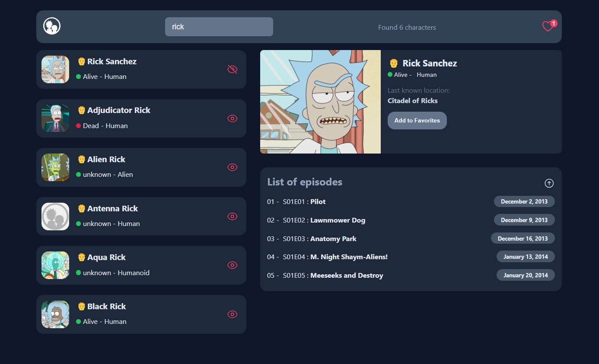
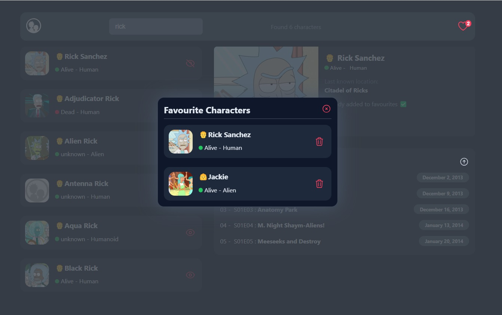
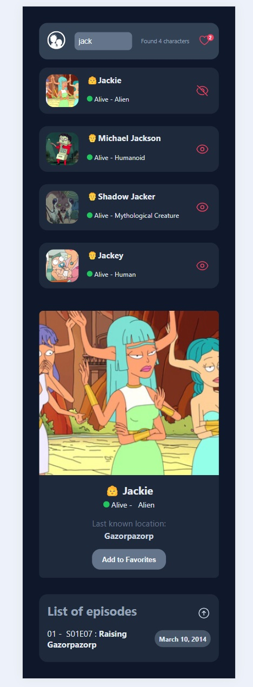

# The Rick and Morty Project by Elle Famkar (React-based)

## Welcome to the Rick and Morty! 👋😍

ℹ️ Remember to install node package and then command -> npm run dev so as to start the project

## Table of contents

- [Overview](#overview)
  - [The challenge](#the-challenge)
  - [Screenshot](#screenshot)
  - [Links](#links)
- [My process](#my-process)
  - [Built with](#built-with)
  - [What I learned](#what-i-learned)
  - [Continued development](#continued-development)
  - [Useful resources](#useful-resources)
- [Author](#author)
- [Acknowledgments](#acknowledgments)

## Overview

Thank you for exploring this React project! The goal was to gain experience with React, hooks, and real data integration. I hope you enjoy it and welcome your feedback!

Remember that "Every day is a learning day", so let's checkout the requirements to start such project

### The challenge

In his project you should be able to:

- Have a good react mindset
- Good state management
- Component composition
- Lift states up
- Children props
- React hooks
- Clear up data fetching
- Error handling in axios

### Screenshot





### Links

- Live Site URL: [The Rick and Morty](https://the-rick-and-morty-elle.netlify.app/)

## My process

### Where to find resources

This repository provides even the smallest details about the requirements of this project such as `styles`, `logics` and `structures` as well as finding all the required assets in the `/images` folder.

### Built with

- react
- react hooks
- heroicons
- react hot toasts
- axios
- CSS
- Semantic HTML5 markup
- desktop-first workflow

You can use any tools you like to help you complete the project. So if you got something you'd like to practice, feel free to give it a try.

### What I learned

This projects helped me being more confident with the details of react components, hooks and their importance, data integration and react mindset to create a responsive and dynamic web app.

To see parts of my codes and see how you can add code snippets, see below:

```Jsx

  useEffect(() => {
    async function fetchCharacter() {
      try {
        setIsLoading(true);
        setCharacter(null);
        const { data } = await axios.get(
          `https://rickandmortyapi.com/api/character/${selectedId}`
        );
        setCharacter(data);

        const episodeId = data.episode.map((e) => e.split("/").at(-1));
        const { data: episodeData } = await axios.get(
          `https://rickandmortyapi.com/api/episode/${episodeId}`
        );
        setEpisodes([episodeData].flat().slice(0, 5));

        setIsLoading(false);
      } catch (err) {
        toast.error(err.response.data.error);
      } finally {
        setIsLoading(false);
      }
    }

    if (selectedId) fetchCharacter();
  }, [selectedId]);

  if (isLoading) {
    return (
      <div style={{ flex: 1 }}>
        <Loading />
      </div>
    );
  }

  if (!character || !selectedId) {
    return (
      <div style={{ flex: "1", color: "var(--slate-300)" }}>
        Please Choose a character!
      </div>
    );
  }

  return (
    <div style={{ flex: 1 }}>
      <CharacterSubInfo
        character={character}
        onAddFavourite={onAddFavourite}
        isAddToFavourites={isAddToFavourites}
      />
      <Episodes episodes={episodes} />
    </div>
  );
}


export default CharacterDetails;

function CharacterSubInfo({ character, isAddToFavourites, onAddFavourite }) {
  return (
    <div className="character-detail">
      
      <div className="character-detail__info">
        <h3 className="name">
          <span>{character.gender === "Male" ? "👨" : "👩"}</span>
          <span>&nbsp;{character.name}</span>
        </h3>
        <div className="info">
          <span
            className={`status ${character.status === "Dead" ? "red" : ""}`}
          ></span>
          <span>&nbsp;{character.status}</span>
          <span> - &nbsp; {character.species}</span>
        </div>
        <div className="location">
          <p>Last known location:</p>
          <p>{character.location.name}</p>
        </div>
        <div className="actions">
          {isAddToFavourites ? (
            <p>Already added to favourites ✅ </p>
          ) : (
            <button
              className="btn btn--primary"
              onClick={() => onAddFavourite(character)}
            >
              Add to Favorites
            </button>
          )}
        </div>
      </div>
    </div>
  );
}

function Episodes({ episodes }) {
  const [sortBy, setSortBy] = useState(true);

  let sortedEpisodes;

  if (sortBy) {
    sortedEpisodes = [...episodes].sort(
      (a, b) => new Date(a.created) - new Date(b.created)
    );
  } else {
    sortedEpisodes = [...episodes].sort(
      (a, b) => new Date(b.created) - new Date(a.created)
    );
  }

  return (
    <div className="character-episodes">
      <div className="title">
        <h2>List of episodes</h2>
        <button onClick={() => setSortBy((is) => !is)}>
          <ArrowUpCircleIcon
            className="icon"
            style={{ rotate: sortBy ? "0deg" : "180deg" }}
          />
        </button>
      </div>
      <ul>
        {sortedEpisodes.map((item, index) => (
          <li key={item.id}>
            <div>
              {String(index + 1).padStart(2, "0")} - &nbsp;
              {item.episode} : <strong>{item.name}</strong>
            </div>
            <div className="badge badge--secondary">{item.air_date}</div>
          </li>
        ))}
      </ul>
    </div>
  );
}


```

```css
.home-icon svg {
  fill: rgb(255, 255, 255);
}

.navbar__logo {
  color: var(--slate-300);
  font-weight: 700;
}

.main {
  display: flex;
  justify-content: space-between;
  width: 100%;
  gap: 2rem;
}

.characters-list {
  width: 40%;
}

.box h2 {
  color: var(--slate-400);
  font-size: 1.2rem;
  margin-bottom: 1rem;
}
.list__item:not(:last-child) {
  margin-bottom: 1.5rem;
}

.list__item {
  display: grid;
  column-gap: 1rem;
  grid-template-columns: 4rem 1fr 2rem;
  grid-template-rows: 1fr 1fr;
  background-color: var(--slate-800);
  border-radius: 1rem;
  padding: 0.8rem;
  cursor: pointer;
  transition: all 0.2s ease-out;
}
.list__item:hover {
  background-color: var(--slate-700);
}

.list__item img {
  grid-column: 1/3;
  grid-row: 1/3;
  width: 4rem;
  height: 4rem;
  border-radius: 1rem;
}
.list__item h3 {
  grid-column: 2/3;
  grid-row: 1/2;
}

.list__item .list-item__info {
  grid-column: 2/3;
  grid-row: 2/3;
  align-self: center;
}

.list__item .icon {
  grid-column: 3/4;
  grid-row: 1/3;
  align-self: center;
}
```

### Continued development

In my future projects, not only i am going to focus on improving my knowledge of react and typeScript so as to develop more useful and great projects.

### Useful resources

In order to do this project in a correct way you need to have a good knowledge of html and pure css and grid and then tailwind and you need to know how to work with alpine js in the project and connect it to css if you want to use js.

- [w3schools](https://www.w3schools.com/)
- [MDN](https://developer.mozilla.org/en-US/) - Remember that no matter how many tutorial videos you have watched, you always need to learn details and features from codes documentations
- [codeacademy](https://www.codecademy.com/)
- [udemy](https://www.udemy.com/) - Here you can find a number of tutorials in different languages
- [coursera](https://www.coursera.org/)


## Author

- Website : [Elle Famkar](https://bespoke-marigold-f2f8e3.netlify.app/)
- GitHib : [Elle Famkar](https://github.com/ellefamkar)
- Twitter : [@Ellefamkar](https://www.twitter.com/ellefamkar)

Feel free to ask any questions come to your mind on my github account!

## Acknowledgments

I want to thanks everyone who has been inspiring and helpfull with great projects, tips and lessons.

**Have fun using this project!** 🚀
